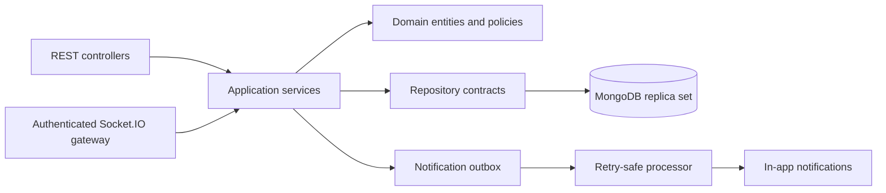
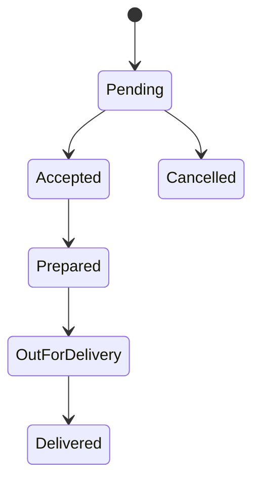

# Multi-Vendor Delivery Platform

[](https://github.com/Sye-1321/multi-vendor-delivery-platform/actions/workflows/ci.yml)

A tenant-aware NestJS backend for multi-vendor food ordering and delivery, designed around transactional ordering, concurrency-safe fulfilment, resource-scoped authorization, durable notifications, and authenticated real-time updates.

## Engineering Highlights

- **Atomic, server-authoritative checkout:** menu items and prices are resolved by the server; cart, order, timeline, and notification-outbox state commit in one MongoDB transaction.
- **Concurrency-safe fulfilment:** lifecycle changes use compare-and-set updates, while courier availability and assignment change atomically to prevent competing claims.
- **Durable notifications:** the outbox processor atomically claims events, deduplicates delivery, recovers stale locks, retries with exponential backoff, and dead-letters repeated failures.
- **Authorized real-time updates:** Socket.IO connections are authenticated and order-room subscriptions are checked against customer ownership, restaurant administration, or delivery-operator scope.
- **Refresh-token replay controls:** refresh tokens are hashed and rotated; reuse of an invalidated token revokes the active refresh session.
- **Operational visibility:** structured JSON logs carry correlation IDs and redact sensitive fields; separate liveness and database-readiness endpoints distinguish process health from MongoDB availability.

## Architecture



The application is a modular monolith: one deployable service with HTTP and WebSocket entry points, MongoDB persistence, and a durable notification processor. Internal module boundaries protect business behavior without adding unnecessary network boundaries.

### Main Modules

```text
src/
|-- bootstrap/          validated runtime configuration
|-- infrastructure/     authentication, context, persistence, logging, email
|-- user/               identity and profile workflows
|-- company/            restaurant-company administration
|-- restaurant/         restaurant ownership and operations
|-- menu/               restaurant menus
|-- menu-item/          tenant-scoped catalog items
|-- order/              checkout, lifecycle, timeline, and real-time updates
|-- delivery-person/    courier eligibility, claiming, and release
|-- notifications/      durable outbox and in-app notifications
|-- restaurant-review/  restaurant feedback
`-- system-review/      platform feedback
```

## Critical Workflows

### Transactional Checkout

The client supplies item identifiers, quantities, customizations, and a
delivery address. Prices and subtotals are never trusted from the request.

Checkout:

1. Loads available menu items within the selected restaurant.
2. Calculates totals in integer minor units.
3. Creates cart items, the cart, and the order with one MongoDB session.
4. Writes the initial timeline entry and notification intent in that
   transaction.
5. Publishes real-time state only after the transaction commits.

Any failure rolls the complete checkout back.

### Order Lifecycle



Customers may cancel only a pending order and must supply a reason. Every
transition is a conditional database update: a competing request succeeds only
if the order still has the expected previous state.

### Courier Assignment

Courier availability and order assignment change in the same transaction. A
courier is claimed only when active, eligible for the restaurant's fulfilment
model, and currently available. Competing claims return a conflict instead of
double-assigning the courier.

### Durable Notifications

An order transition and its outbox intent commit together. The processor:

- atomically claims one due event;
- recovers abandoned processing locks;
- creates the in-app notification idempotently;
- retries failures with exponential backoff;
- moves repeated failures to dead-letter state.

This prevents committed order changes from silently losing their notification.

### Real-Time Order Updates

Socket.IO uses the `/orders` namespace and WebSocket transport.

Pass an access token either as `auth.token` or a Bearer authorization header,
then emit:

```json
{
  "event": "order:subscribe",
  "data": {
    "orderId": "MongoDB ObjectId"
  }
}
```

The server authorizes the room against customer ownership, restaurant
administration, or operator scope. A successful subscription returns the
persisted order snapshot for reconnect synchronization. Later committed
changes are emitted as `order:updated`.

## Business Model

The platform supports three operating arrangements:

- A company can manage several restaurant branches.
- An independent restaurant can operate without a parent company.
- A restaurant can use its own couriers or request a courier from the shared delivery operator.

Delivery personnel are coordinated by restaurant or delivery-company administrators. Direct courier accounts and GPS tracking are outside the current scope.

## Roles and Authorization

| Role | Main responsibilities |
| --- | --- |
| Customer | Browse restaurants, place and cancel orders, track progress, and submit reviews |
| Business administrator | Manage a restaurant company and its branches |
| Restaurant administrator | Manage a restaurant, catalog, orders, and restaurant-owned couriers |
| Delivery-company administrator | Manage shared couriers and platform fulfilment |
| System administrator | Perform platform-level administration |

Authorization combines role checks with resource ownership. Customer and restaurant order queries include their ownership scope in the database query, so another tenant's resource is not loaded before access is denied.

## API Overview

All REST endpoints use the `/api/v1` prefix.

| Area | Example routes |
| --- | --- |
| Health | `GET /health/live`, `GET /health/ready` |
| Authentication | `POST /auth/register`, `POST /auth/login`, `POST /auth/token/refresh`, `POST /auth/logout` |
| Profile | `GET /users/me`, `PATCH /users/me`, `PATCH /users/me/password` |
| Restaurants | `/restaurants` |
| Catalog | `/menus`, `/menu-items` |
| Orders | `/orders` |
| Notifications | `GET /notifications`, `PATCH /notifications/:notificationId/read` |
| Reviews | `/restaurant-reviews`, `/system-reviews` |

Protected endpoints require:

```http
Authorization: Bearer <access-token>
```

## Technology

- Node.js 20+
- TypeScript
- NestJS 11
- MongoDB 7 and Mongoose
- Passport and JWT
- Socket.IO
- Winston
- Jest
- Docker Compose

## Local Setup

Requirements:

- Node.js 20 or newer
- npm 10 or newer
- Docker with Docker Compose

Clone and install:

```bash
git clone https://github.com/Sye-1321/multi-vendor-delivery-platform.git
cd multi-vendor-delivery-platform
npm ci
```

Create local configuration:

```bash
cp .env.example .env
```

The committed values are local-development examples. Replace all JWT secrets
and SMTP credentials outside local development.

Start the MongoDB replica set:

```bash
docker compose up -d
```

Start the API:

```bash
npm run start:dev
```

The default API address is `http://localhost:4000/api/v1`.

Stop local infrastructure without deleting data:

```bash
docker compose stop
```

## Verification

Run the same quality gate used by CI:

```bash
npm run verify
```

It checks:

1. Prettier formatting
2. ESLint with zero warnings
3. Production compilation
4. Focused behavior tests

The test suite intentionally protects high-risk boundaries rather than pursuing
a coverage percentage. Current checks cover readiness, request-context
isolation, cross-restaurant catalog selection, refresh-token replay, and
cross-customer WebSocket subscription.

## Operational Notes

- Transactions require the provided MongoDB replica-set configuration.
- JSON logs are written to the console and daily rotating files.
- Correlation IDs propagate through HTTP requests, order timelines, real-time
  events, and notification intents.
- Collection endpoints should be bounded before exposing them to untrusted,
  high-volume traffic.
- Online payment processing, route optimization, GPS tracking, and courier
  mobile applications are intentionally not implemented.

## License

This repository is currently unlicensed. All rights are reserved.
