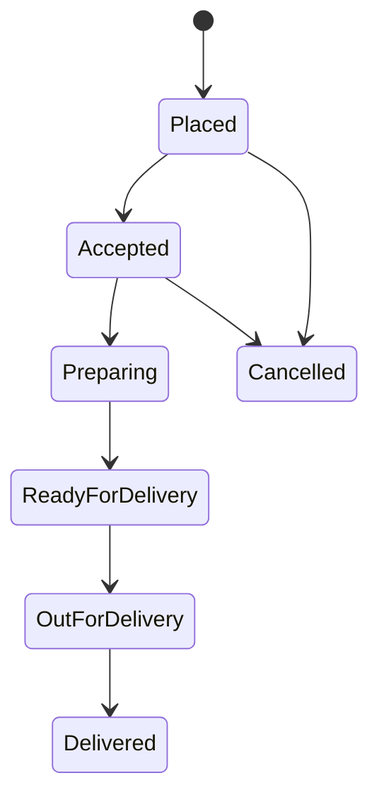
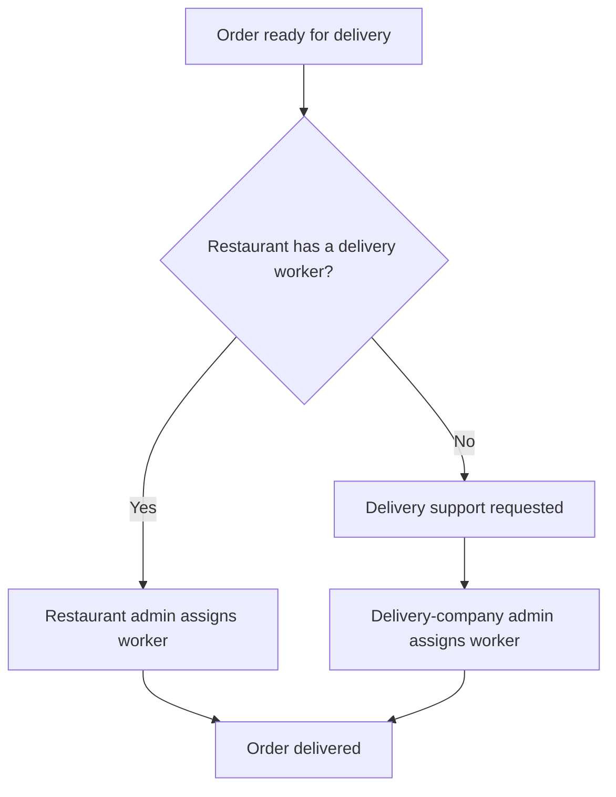
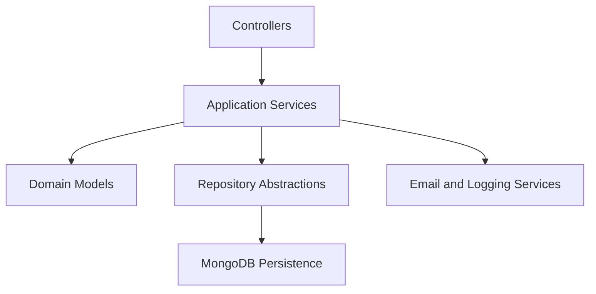

# Multi-Tenant Food Delivery Platform

A modular food-delivery backend designed for the operational needs of restaurants, customers and delivery providers in Mekelle, Ethiopia.

The platform enables customers to discover restaurants and place orders, allows restaurant companies to manage multiple restaurant branches, and supports restaurants with or without their own delivery personnel.

This repository contains the backend implementation developed with NestJS, TypeScript and MongoDB.

## Project Purpose

Many restaurants in Mekelle depend on telephone calls and social-media messages to receive and coordinate delivery orders. Smaller restaurants may not have their own delivery workers, while customers have limited ways to compare restaurants, browse menus or follow the progress of an order.

This platform provides a centralized system that connects:

- Customers
- Restaurant-owning companies
- Individual restaurants
- Restaurant administrators
- Delivery-company administrators
- Delivery personnel

The design accounts for local infrastructure and digital-literacy limitations. Delivery personnel are managed by administrators instead of being required to operate a dedicated application.

## Business Model

The platform supports different restaurant and delivery arrangements.

### Restaurants with their own delivery service

A restaurant may register and manage its own delivery personnel. When an order is ready, the restaurant administrator assigns one of the restaurant’s available delivery workers.

### Restaurants without a delivery service

A restaurant that does not employ delivery personnel can request support from the platform’s delivery company. The delivery-company administrator assigns a suitable worker from the shared delivery pool.

### Restaurant-owning companies

A company may own and manage multiple restaurants. A company administrator can create restaurants, assign restaurant administrators and oversee operations across the company’s restaurants.

This structure makes the platform multi-tenant at the business level because several companies and restaurants can operate through the same system while maintaining their respective administrative responsibilities.

## User Roles

### Customer

Customers can:

- Register and verify their accounts
- Sign in securely
- Browse available restaurants
- View restaurant menus
- Add menu items to a cart
- Place orders
- Monitor order status
- Review restaurants
- Manage their profile and account

### Company Administrator

A company administrator can:

- Manage company information
- Create and manage restaurants belonging to the company
- Assign administrators to restaurants
- Monitor the company’s restaurant operations
- Review restaurant and administrative information

### Restaurant Administrator

A restaurant administrator can:

- Manage restaurant information
- Create and update menus
- Manage menu items
- Receive and process customer orders
- Update order status
- Assign available restaurant delivery personnel
- Request delivery support when the restaurant has no available delivery worker
- Review customer feedback

### Delivery Company Administrator

The delivery-company administrator represents the operator of the overall delivery platform and can:

- Manage restaurant-owning companies
- Manage independent restaurant relationships
- Maintain the shared delivery-personnel database
- Assign delivery workers to requested orders
- Monitor delivery operations
- Review platform and restaurant feedback
- Manage platform-level administrative activities

### Delivery Personnel

Delivery personnel do not have direct system access in the current implementation. Their information and assignments are managed by restaurant or delivery-company administrators.

This approach supports workers who may have limited access to smartphones, stable internet or experience using digital platforms.

## Main Features

### Account and Access Management

- User registration and authentication
- Email verification
- JWT access and refresh tokens
- Password hashing with bcrypt
- Password-reset workflow
- Email-change confirmation
- Profile management
- Account activation and deactivation
- Administrative account suspension
- Role-based access control

### Company and Restaurant Management

- Restaurant-company management
- Support for companies operating multiple restaurants
- Independent restaurant management
- Restaurant-administrator assignment
- Restaurant profile management
- Separation of company-level and restaurant-level responsibilities

### Menu Management

- Menu creation and management
- Menu-item creation and updating
- Restaurant-specific menus
- Customer menu browsing

### Cart and Order Processing

- Customer cart management
- Cart-item management
- Order creation
- Restaurant order processing
- Structured order-status updates
- Delivery-person assignment
- Administrative delivery coordination

### Reviews and Feedback

- Customer restaurant reviews
- Platform-level reviews
- Rating and feedback management
- Review information for administrative oversight

### Auditing and Logging

- Request-context management
- Audit information for important operations
- Centralized exception handling
- Structured application responses
- Sensitive-data filtering in logs
- Winston-based application logging
- Daily log rotation support

## Order Lifecycle

An order moves through a controlled sequence of operational states:



The main stages are:

1. **Placed** – The customer submits an order.
2. **Accepted** – The restaurant accepts the order.
3. **Preparing** – The restaurant begins preparing the food.
4. **Ready for Delivery** – The order is ready to be collected.
5. **Out for Delivery** – A delivery worker has received the order.
6. **Delivered** – The customer has received the order.
7. **Cancelled** – The order is stopped before completion when cancellation is permitted.

This workflow provides consistent order handling across customers, restaurants and delivery administrators.

## Delivery Assignment Workflow



The platform does not require delivery workers to use a separate application. Administrators maintain their information and coordinate assignments manually, including through phone communication where necessary.

## Backend Architecture

The backend follows a modular architecture influenced by Domain-Driven Design.



### Domain Modules

Each major business capability is separated into a dedicated module:

- Users
- Companies
- Restaurants
- Menus
- Menu items
- Carts
- Cart items
- Orders
- Delivery personnel
- Restaurant reviews
- System reviews
- Auditing

### Dependency Injection

NestJS dependency injection and typed injection tokens are used to connect services, repositories, mappers and infrastructure implementations. This reduces direct dependencies between business logic and technical services.

### Repository Pattern

Domain services communicate with repositories instead of directly accessing MongoDB. A generic document repository provides shared persistence operations, while domain-specific repositories handle entity-related queries.

### Mapping and Response Separation

Mappers and parsers separate:

- Domain entities
- MongoDB persistence documents
- API request and response objects

This prevents database structures and sensitive fields from being exposed directly through API responses.

### Result Pattern

A custom `Result<T>` structure provides consistent success and failure handling across application services.

### Centralized Error Handling

A global exception-handling mechanism produces structured error responses containing relevant information such as:

- HTTP status
- Error message
- Request method
- Request path
- Timestamp

Server errors are logged while sensitive information is excluded from output.

## Project Structure

```text
src/
├── application/          # Application constants and dependency tokens
├── audit/                # Audit-related functionality
├── cart/                 # Customer cart operations
├── cart-item/            # Cart-item operations
├── company/              # Restaurant-company management
├── delivery-person/      # Delivery-person records and assignments
├── domain/               # Shared domain objects and result handling
├── infrastructure/       # Database, authentication, email and logging
├── menu/                 # Restaurant menu management
├── menu-item/            # Menu-item management
├── order/                # Order processing and lifecycle management
├── restuarant/           # Restaurant management
├── restuarant-review/    # Restaurant ratings and reviews
├── shared/               # Shared application components
├── system-review/        # Platform-level feedback
├── user/                 # Accounts, authentication and profiles
├── utils/                # General utilities
├── app.module.ts         # Root application module
└── main.ts               # Application entry point
```

## Technology Stack

| Category | Technology |
|---|---|
| Language | TypeScript |
| Backend framework | NestJS |
| Database | MongoDB |
| Object modelling | Mongoose |
| Authentication | JWT and Passport |
| Password security | bcrypt |
| Validation | class-validator, Joi and Zod |
| Email communication | Nodemailer |
| Real-time communication | Socket.IO and NestJS WebSockets |
| Logging | Winston |
| Testing | Jest |
| Package management | npm |

The complete project design also includes separate React applications for the customer portal and administrative dashboards. Those frontend applications are not part of this backend repository.

## Security Design

The backend applies several security controls:

- Password hashing before persistence
- JWT-based authentication
- Access and refresh-token workflows
- Role-based authorization
- Account-status verification
- Email-based account verification
- DTO validation
- Request sanitization
- Controlled response mapping
- Environment-based configuration
- Centralized exception handling
- Filtering of sensitive information from logs

## Installation

Clone the repository:

```bash
git clone https://github.com/Sye-1321/Multi-Tenant-Delivery-App.git
cd Multi-Tenant-Delivery-App
```

Install dependencies:

```bash
npm ci
```

Create the local environment file:

```bash
cp .env.example .env
```

Start the MongoDB replica set used by transactional order operations:

```bash
docker compose up -d
```

The example credentials are intended only for local development. Replace all
token secrets in deployed environments.

Start the application in development mode:

```bash
npm run start:dev
```

Create a production build:

```bash
npm run build
```

Run the production build:

```bash
npm run start:prod
```

The versioned API is available under `/api/v1`. Health endpoints are exposed at
`/api/v1/health/live` and `/api/v1/health/ready`.

## Testing

Run the complete local verification sequence:

```bash
npm run verify
```

Run the focused test suite independently:

```bash
npm run test
```

Apply formatting or lint fixes explicitly:

```bash
npm run format
npm run lint:fix
```

## Current Scope

The current implementation includes:

- Customer account management
- Restaurant and menu browsing
- Cart and order processing
- Role-based administrative operations
- Company and restaurant management
- Manual delivery assignment
- Restaurant reviews
- Structured order-status management

## Current Limitations

The following features are outside the current implementation:

- Direct accounts for delivery personnel
- GPS-based real-time delivery tracking
- Online payment-gateway integration
- Mobile applications
- Offline order processing
- Ordering from multiple restaurants in one checkout
- Advanced business analytics

These limitations represent possible future extensions rather than functionality provided by the current version.

## Future Development

Potential enhancements include:

- Android and iOS applications
- Delivery-person accounts and dashboards
- Real-time GPS tracking
- Integration with Ethiopian payment services
- Multi-restaurant checkout
- Menu-item reviews
- Restaurant analytics
- Automated delivery matching
- Improved offline and low-connectivity support

## Project Context

The platform was designed around the operational and infrastructure conditions of Mekelle. Its purpose is to improve restaurant visibility, simplify customer ordering and expand delivery opportunities without assuming that every participant has continuous internet access or advanced digital skills.

The project demonstrates how software architecture can be adapted to a specific local business environment rather than directly copying the operating model of global delivery platforms.
